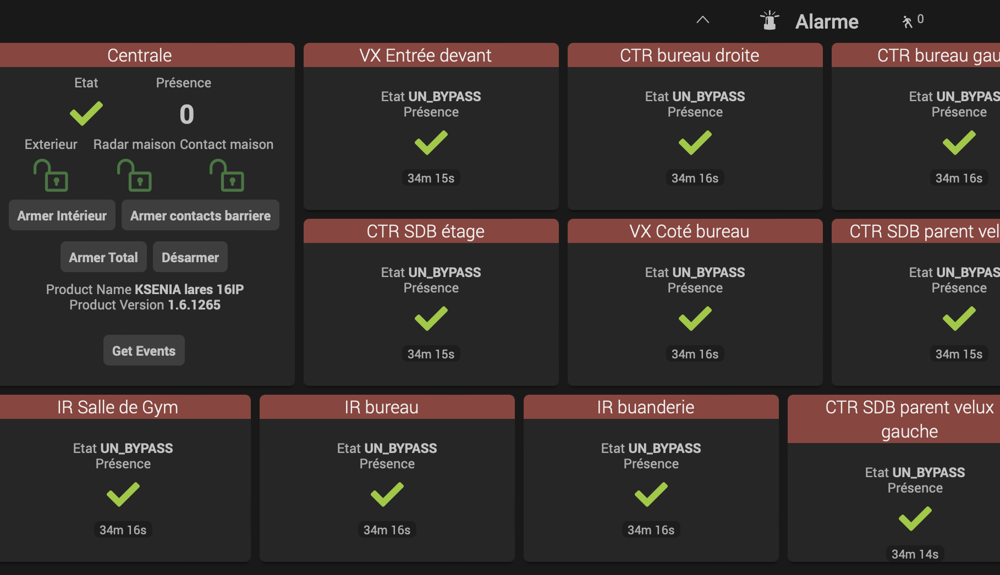

# Plugin KSENIA LARES 16IP pour Jeedom V4 

plugin-jeeksenia is a Jeedom V4 plugin for the KSENIA lares 16IP alarm

## Utilisation

- activer le plugin et choisir une frequence de mise a jour , 5-6 sec est un bon choix
- creer un equipement racine pour la centrale ( avec addr ip, port , user name, pwd pour l'acces au site web de la centrale et PIN code pour les scenarios ). 
- Choisir un objet parent pour l'equipement racine.
- Au prochain save de l'equipement racine les equipements Zones seront crees. les equipements sont crees par defaut sous le meme objet parent que la racine.
- Des commandes action sont crees sur l'equipement racine pour chacun des scenarios commandables sur la KSenia
- Des commandes info sont crees sur l'equipement racine pour chacune des partitions de l'alarme et contiendront le status d'armement
- les derniers evenements de la centrale sont affiches dans la page de configuration de l'equipement

## Commandes

### KSenia Root equipment

- **Etat** : 1 si la connectivité fonctionne et que l'on recoit des donnees
- **Présence** : compte le nombre de zone(s) qui detecte une presence ( 0 rien,  1 ou plus = le nombre de detecteur(s) avec présence confirmée)
- **Product Name** : return the KSenia product name. this plugin only works for KSENIA lares 16IP
- **Product Version** : return the KSenia product version : High.Low.Build
- **Events** : the last list of events downloaded from the alarm with the 'Show Event' action
- **Show Events** : an action to trigger the refresh of the list of event. there is a custom widget for that command called jeeksenia::dispevent which enable clicking on that action button on the dashboard and open a model to display the list of events
- **per each partition** : an info command for each partition that will contain the partition status
- **per each scenario** : an action command is created for every single scenario programmed in the KSenia. the command's name is the scenario's name. triggering the action, will call the scenario in KSenia, based on the PIN code entered in the root equipement configuration

### KSenia Zone equipment

- **Présence** : detection de présence ( 1 ) ou absence (0 )
- **Etat** : Etat du capteur de la zone ( UN_BYPASS en mode normal , LOST si perdu )

## Configuration

- **IP** : ip address of the KSenia alarm
- **Port** : port number of the KSenia alarm
- **User Name** : user name credential
- **Mot de passe** : le mot de passe
- **PIN code** : le pin code pour activer les scenarios/partitions

NOTE:  Encryption: le `password` et le `pincode` sont encryptés dans la base de donnees.

## Change Log

[Change Log](changelog.md)

## Installation

after installation, the device appear on your dashboard this way

Clicking on the "Show events" dashboard button, shows a list of the alarm recent events in the modale dialog box
